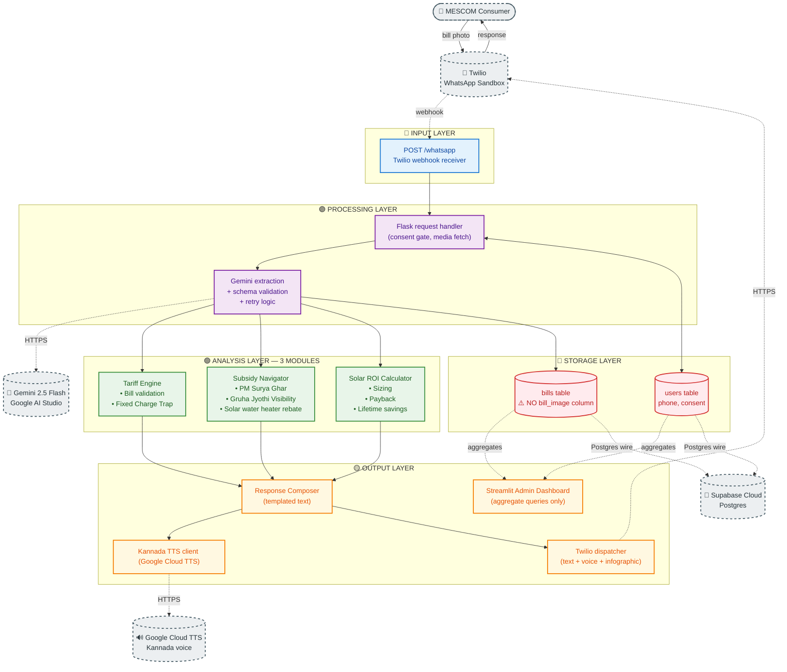
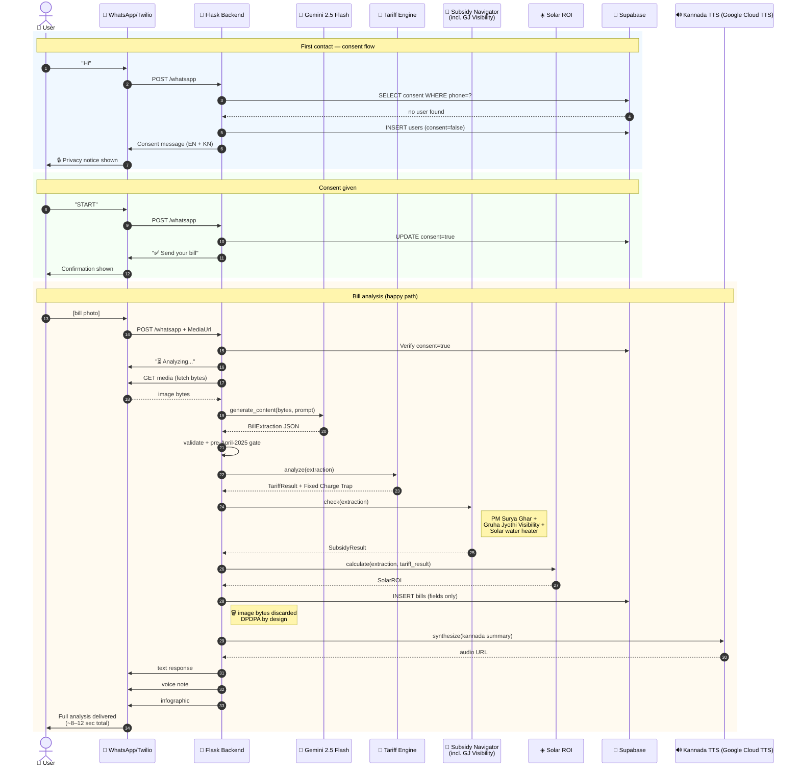
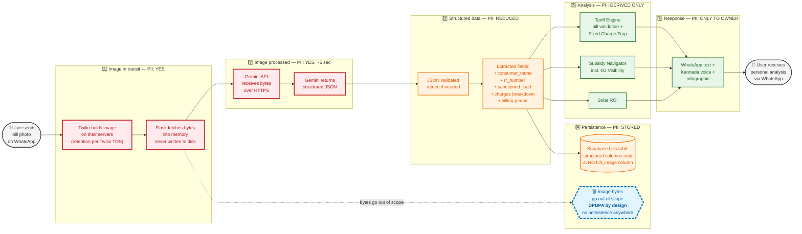
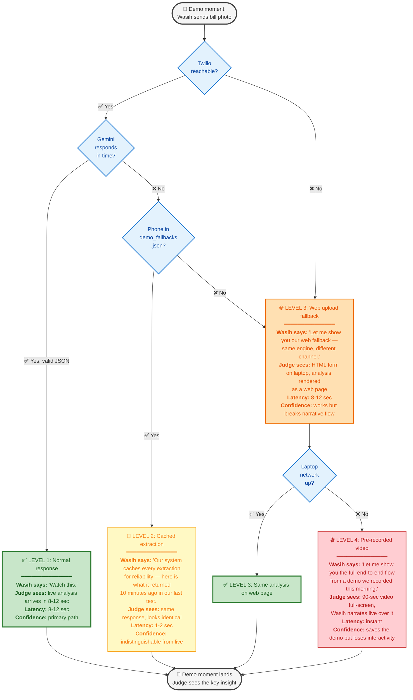

# VidyutMitra: Architecture Diagrams

**Version:** 1.0 | **Date:** April 17, 2026
**Architectural assumption:** v3 — 3 analysis modules (Tariff Engine, Subsidy Navigator, Solar ROI Calculator). Gruha Jyothi Visibility is part of the Subsidy Navigator. No Slab Optimizer anywhere in the codebase.

This document contains 4 diagrams. Each includes (1) Mermaid code ready to paste into mermaid.live, (2) an Excalidraw redraw specification with exact colors and layout, (3) placement and purpose, and (4) usage notes.

---

## Diagram 1: System Architecture (Layered View)

### Mermaid code

### Excalidraw redraw specification

**Overall layout:** Vertical stack, 5 horizontal bands (layers), top to bottom. External services floated to the right margin at their respective layer heights.

**Canvas size:** 1920×1080 (fits a standard 16:9 slide).

**Color palette (use Material Design colors for clean PPT appearance):**

| Layer                                                | Fill                     | Border                       | Text      |
| ---------------------------------------------------- | ------------------------ | ---------------------------- | --------- |
| Input (band 1, top)                                  | `#E3F2FD` (light blue)   | `#1976D2`                    | `#0D47A1` |
| Processing (band 2)                                  | `#F3E5F5` (light purple) | `#7B1FA2`                    | `#4A148C` |
| Analysis (band 3, center — make visually prominent) | `#E8F5E9` (light green)  | `#388E3C`                    | `#1B5E20` |
| Output (band 4)                                      | `#FFF8E1` (light amber)  | `#F57C00`                    | `#E65100` |
| Storage (band 5, bottom)                             | `#FFEBEE` (light red)    | `#D32F2F`                    | `#B71C1C` |
| External services                                    | `#ECEFF1` (grey)         | `#455A64` with dashed border | `#263238` |

**Visual hierarchy:**

- Layer band labels in bold 24pt on the left edge of each band
- Component boxes rounded rectangles, 16pt text
- External services drawn as cylinders (like database icons) with dashed borders to distinguish from internal components
- Analysis layer is tallest/most prominent — this is where the IP lives
- A subtle red warning badge next to "bills table": `⚠️ NO bill_image column — DPDPA by design`

**Arrow styles:**

- Solid arrows for in-process data flow
- Dashed arrows for external HTTPS calls
- Bi-directional arrow between Flask and users table (consent lookup + insert/update)

**Key highlights:**

- Draw a subtle dashed box around the three analysis modules with the label "**3 modules — no Slab Optimizer (removed per KERC 2025)**" above it
- Put the consumer's icon (👤) and the WhatsApp bubble as the entry point on the top left
- Put the "response" arrow going back to the consumer from the bottom output layer, making a visual loop

**Annotations on the diagram:**

- Top: "VidyutMitra — 5-layer architecture, 36 hours to build"
- Bottom right corner: "Tariff constants: KERC Tariff Order 2025"

### Placement and purpose

- **PPT slide 3** (right after Problem and Idea, before Demo): the 15-second architectural story
- **Technical documentation Section 2** (Architecture Overview): the canonical reference
- **Submission portal "Architecture" field**: attach this as the primary image

### 15-second judge takeaway

*"The bill goes in at the top via WhatsApp, gets structured by Gemini, passes through three calibrated analysis modules, and returns as text + voice + image — and none of that image is ever stored."*

### The single most important thing a judge should notice

The **bills table has no `bill_image` column**. Everything else is commodity architecture; the deliberate absence of image storage is the DPDPA-by-design commitment made visible. Draw attention to it with a ⚠️ badge.

### If the Mermaid rendering looks cluttered

- Collapse `Users` and `Bills` into a single `Supabase (users + bills)` node if slide real estate is tight — you lose the "no bill_image" detail (compensate with an annotation)
- Remove the Streamlit Admin node from the slide version; keep it only in the technical doc version
- Remove the External services from the slide version (leave them only in the tech doc); the slide version focuses on internal layers

---

## Diagram 2: User Flow Sequence Diagram

### Mermaid code

### Excalidraw redraw specification

**Overall layout:** Vertical lifelines left-to-right in this order: User | WhatsApp/Twilio | Flask | Gemini | Tariff | Subsidy | Solar | Supabase | TTS. Time flows top to bottom.

**Canvas size:** 1920×2400 (scroll-friendly, since sequence diagrams are vertical).

**Color-coded phases (horizontal bands behind the lifelines):**

| Phase           | Fill                     | Label                                       |
| --------------- | ------------------------ | ------------------------------------------- |
| First contact   | `#F0F8FF` (alice blue)   | "Consent flow — user has not opted in yet" |
| Consent granted | `#F5FFF5` (honeydew)     | "User opts in with START"                   |
| Bill analysis   | `#FFFAF0` (floral white) | "Bill → analysis → response"              |

**Lifeline styling:**

- Each actor gets a header box at the top with icon + name
- Lifelines are thin dashed vertical lines
- Activation boxes (solid rectangles on the lifeline) show when each actor is actively processing
- Color activation boxes by phase band they sit in

**Critical annotations to draw:**

- Next to the `INSERT bills` call: a 🗑️ trash icon with the caption **"image bytes discarded — DPDPA by design"**
- At the bottom: a stopwatch icon with **"end-to-end: 8–12 seconds"**
- On the right margin of the bill-analysis phase: a vertical annotation reading **"all 3 analysis modules run in sequence; ~30 ms total"**

**Arrow styles:**

- Solid arrows for outbound messages (request)
- Dashed arrows for return messages (response)
- Thick red arrow for the one that matters most: the bytes-to-Gemini call, which is the "image briefly leaves our control" moment

### Placement and purpose

- **Technical documentation Section 3** (Data Flow): the canonical developer reference
- **Appendix in submission PDF**: attach as supplementary material
- Do NOT put in the PPT — too dense for a 5-minute pitch

### 15-second developer takeaway

*"A bill takes 3 round-trips (Twilio media fetch, Gemini extraction, Kannada TTS) and 3 pure-function analysis calls to produce a response. The image briefly lives in memory, never on disk, and the analysis modules run against extracted JSON only."*

### The single most important arrow

The **"image bytes discarded"** annotation next to the database write. It's the visual proof that image-to-JSON is the last time the image exists in our infrastructure. Everything downstream is derived, structured data.

### If the Mermaid rendering looks cluttered

- Collapse the three analysis modules into a single "Analysis Layer" participant if rendering is unreadable; lose the parallelism detail
- Drop the consent flow section if the diagram is only being used to document bill analysis (keep it in a separate "Consent Flow" sequence diagram)
- If the `autonumber` makes step numbers hard to read, switch it off

---

## Diagram 3: Data Flow with DPDPA Annotations

### Mermaid code

### Excalidraw redraw specification

**Overall layout:** Horizontal left-to-right, 6 numbered stages. This is deliberately a linear story: "the image starts here, transforms through these states, and ends up as derived analysis only."

**Canvas size:** 2400×900 (wide).

**Color-coded PII sensitivity bands (this is the core visual message):**

| PII State                | Fill                     | Border                             | Text      |
| ------------------------ | ------------------------ | ---------------------------------- | --------- |
| PII: YES (hot zone)      | `#FFEBEE` (light red)    | `#C62828`                          | `#B71C1C` |
| PII: REDUCED             | `#FFF3E0` (light orange) | `#EF6C00`                          | `#E65100` |
| PII: DERIVED ONLY (safe) | `#E8F5E9` (light green)  | `#2E7D32`                          | `#1B5E20` |
| DPDPA marker (discard)   | `#E1F5FE` (light sky)    | `#0277BD` with thick dashed border | `#01579B` |

**Visual language:**

- Use a thermometer-style color gradient at the top: red on the left (PII hot) → orange in the middle (PII reduced) → green on the right (PII derived)
- Each stage is a rounded-rectangle frame with the stage number and PII state label inside
- Components within each stage are smaller boxes nested inside

**The "discarded" marker:**

- Draw this as a detached box below the main flow, with a dashed arrow pointing DOWN from the Flask-memory stage
- Use a literal trash-can icon
- Border thickness 4px (thicker than other elements) so it visually pops
- Label text: "**DPDPA by design**" in bold

**Annotations:**

- At each stage, a small "duration" badge: Stage 1 "~2 sec in transit", Stage 2 "~5 sec in Gemini", Stage 3 "~20 ms", Stage 4 "persisted indefinitely until STOP", Stage 5 "~30 ms", Stage 6 "delivered"
- Below the diagram, a legend: "PII = Personally Identifiable Information. We minimize the time and scope PII spends in our system."

**Key highlight:**

- A red arrow with a "⚠️ image leaves our infrastructure" label on the Flask→Gemini transition (honest: we acknowledge Google briefly sees the image)
- A large green checkmark on the Stage 3→Stage 4 boundary, where the image-to-structured-data transformation completes and raw image is no longer referenced

### Placement and purpose

- **Technical documentation Section 9** (DPDPA Compliance Design): the canonical privacy trace
- **PPT slide 7** (Privacy / DPDPA): a simplified version with fewer nodes but same color story
- **Response to any judge question about data privacy**: pull this diagram up and trace the flow

### 15-second privacy-conscious judge takeaway

*"The image exists hot for ~5 seconds during Gemini processing, then is discarded before anything writes to disk. What persists is structured text only, and even that is deleted by CASCADE on user STOP."*

### The single most important component

The **🗑️ discarded box with "DPDPA by design" label**. It's the architectural commitment rendered visually. The dashed blue border and detached placement should make it the second thing a judge's eye lands on after the color gradient.

### If the Mermaid rendering looks cluttered

- Merge Stages 2 and 3 into a single "Gemini processing" stage if 6 stages is too many
- Collapse A1/A2/A3 into a single "Analysis" node; the detail isn't the point of this diagram
- If the "image bytes go out of scope" arrow is hard to read, replace with a text annotation in the Stage 4 box: "(image bytes: already discarded)"

---

## Diagram 4: Fallback Ladder State Diagram

### Mermaid code

### Excalidraw redraw specification

**Overall layout:** Vertical decision tree, top to bottom. Start at the top, end at the bottom. Decision diamonds branch horizontally.

**Canvas size:** 1400×1800 (portrait orientation, designed for printing on A4 and folding into a rehearsal card Wasih carries).

**Color-coded confidence levels:**

| Level             | Fill                     | Border        | Emotional weight       |
| ----------------- | ------------------------ | ------------- | ---------------------- |
| Level 1 — Normal | `#C8E6C9` (medium green) | `#2E7D32` 3px | Calm, confident        |
| Level 2 — Cached | `#FFF9C4` (light yellow) | `#F9A825` 2px | Cautious, solid        |
| Level 3 — Web    | `#FFE0B2` (light orange) | `#EF6C00` 2px | Pivoting, still calm   |
| Level 4 — Video  | `#FFCDD2` (light red)    | `#C62828` 2px | Emergency, last-resort |
| Decisions         | `#E3F2FD` (light blue)   | `#1976D2` 2px | Neutral                |

**Visual hierarchy:**

- Level 1 is the fattest box, 3px border, most visually prominent (because it's what we expect 95% of the time)
- Level 4 is the smallest and most alarming, border colored like a warning label
- Decisions are diamonds, sized proportionally to how often they get hit (most flows pass through L1 and L2)

**Each action box contains 4 lines:**

1. Level badge (e.g., "LEVEL 2: Cached extraction")
2. **Wasih says:** the exact script in italics
3. **Judge sees:** what's visible on the demo phone/laptop
4. **Latency / Confidence:** operational metadata

**Rehearsal card annotations (for Wasih, not shown to judges):**

- At the top: "**Read down. Never skip levels.** If you find yourself at Level 3, the pitch timing is already off — extend by asking the judges a question."
- At the bottom: "**Remember:** the goal isn't to land in Level 1. The goal is to land in whichever level works and keep moving."
- Small boxes in the margins noting common failure modes: "Twilio sandbox 24-hour re-auth", "Gemini API rate limit (60 req/min free tier)", "Venue Wi-Fi fallback to hotspot"

**One bespoke visual element:**

- A subtle "stress meter" bar at the side of the diagram — green at Level 1, yellow at Level 2, orange at Level 3, red at Level 4 — with a note: "Your face stays calm at every level. Practice this specifically."

### Placement and purpose

- **Personal rehearsal document** — print laminated, Wasih carries in left pocket
- **Repo `demo/FALLBACK.md`** — pre-demo sanity check for the team
- **NOT shown to judges** — this is internal ops

### Most important element

The **fact that there are four named levels**, not "Plan A and Plan B." The explicit ladder means Wasih has a graceful response for every failure mode. When something breaks at 2:30pm on April 18, he doesn't panic — he drops one level down.

### Usage notes for rehearsal

Wasih should rehearse each transition **out loud**, separately, on at least three separate occasions before Hackfest. The scripts aren't improv — they're written exactly so they sound confident even when things are breaking. The specific phrases to memorize:

1. Level 1 → Level 2: *"Our system caches every extraction for reliability — here's what it returned 10 minutes ago in our last test."*
2. Level 2 → Level 3 (or Level 1 → Level 3): *"Let me show you our web fallback — same engine, different channel."*
3. Anything → Level 4: *"Let me show you the full end-to-end flow from a demo we recorded this morning."*

The word that does the most work in all three: **"our"**. It positions every fallback as a designed feature, not an improvisation. The ladder is the product, not a bug.

---

## Summary

| Diagram                 | Primary destination                | Audience                 | Time to grasp |
| ----------------------- | ---------------------------------- | ------------------------ | ------------- |
| 1. System Architecture  | PPT slide 3 + Tech Doc §2         | Judges + developers      | 15 seconds    |
| 2. Sequence Diagram     | Tech Doc §3 + submission appendix | Developers               | 1 minute      |
| 3. Data Flow with DPDPA | Tech Doc §9 + PPT slide 7         | Privacy-conscious judges | 15 seconds    |
| 4. Fallback Ladder      | Rehearsal / internal only          | Wasih + teammate         | Memorized     |

All four are ready to paste into mermaid.live. If rendering issues appear in any one of them (Mermaid is finicky with emoji in node labels on some versions), the fix is usually to strip the emoji from the label and add them back as a Unicode character in a comment.

**Recommended rendering targets for each:**

- GitHub README: Diagrams 1 and 3 (these render inline in markdown)
- Notion pages: all four (Notion has excellent Mermaid support)
- VS Code preview: all four (via Mermaid Preview extension)
- Excalidraw: Diagrams 1 and 3 for the PPT (best with the redraw specs above); Diagram 4 for the rehearsal card
- mermaid.live: all four for quick sharing and iteration
